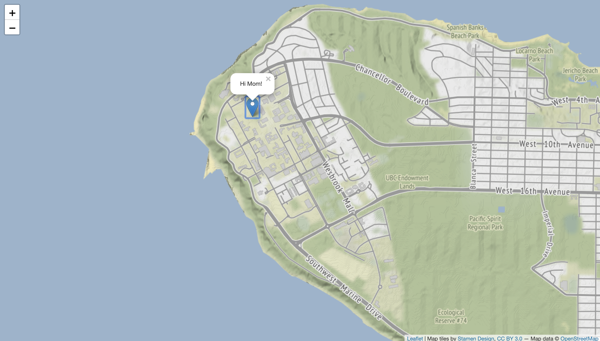
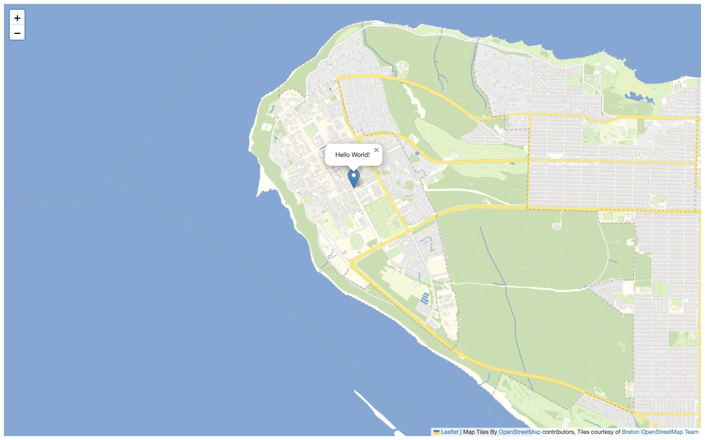

# Add Some Data
Let's add some map features!!

## Add a Leaflet Marker
Leaflet gives us an easy way to add basic map features called **markers**, which represent point locations on the ground. More information about adding basic features to Leaflet can be found in the [Leaflet Quick Start Guide](https://leafletjs.com/examples/quick-start/). Let's add a marker over UBC campus.    

To Do
{: .label .label-green }
Add a Leaflet marker by copy/pasting the text below into the <code>body</code> of your HTML document.


```js
var ubccampus = L.marker([49.260605, -123.245995]).addTo(mymap).bindPopup("Hi Mom!");
```    
You should see something like this (click on the marker too!):    




## Add a GeoJSON
GeoJSON are often more complex data than markers or shapes. But they can be added to your map similarly: by creating a new variable holding the values for the GeoJSON feature(s).    

Let's add a GeoJSON that represents UBC Buildings. Luckily, UBCs Campus and Community Planning releases [their geodata](https://github.com/UBCGeodata) as GeoJSON with an open license. For this workshop, the buildings variable has been pre-assembled, and came with the .zip data you downloaded at the beginning of this workshop (the file <code>ubcbuildings.js</code>).

If you wanted to make a variable for another dataset, this is how it was prepared:
- start with a geoJSON file
- wrap your geoJSON as a variable:
```js
var [nameofyourvariable] = [your geoJSON text]
```
- save this file with a JavaScript file <code>.js</code> extension.f
{: .note}

To add the UBC buildings variable to our map, we'll need to include a Leaflet geoJSON layer so that our map loads this data when initialized:    


To Do
{: .label .label-green }
Add the buildings to your map by copy/pasting the object below into your HTML document, just below the Marker.   


```js
L.geoJSON(ubcbuildings).addTo(mymap);
```    

You should see something like this after you save and reload your browser:    



