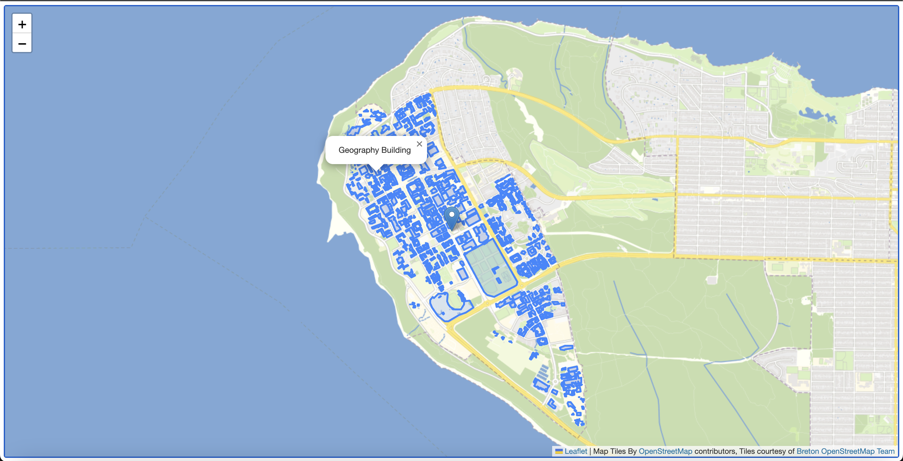

# Configure Popups

The building layer that we added to our map contains attribute values for each of the building features on our map, such as their name, construction date, and the number of floors. If we click on our own map we aren't yet able to see these values because we haven't yet configured our map to load popups for this layer. To do this we'll need to add a ***function***. A function in programming is a block of code that does some specific task, like a mini program. The function below called <code>onEachFeature</code> adds a popup to our map if the layer is clicked, and adds the feature's name. We know from looking at the [UBCGeodata repository](https://github.com/UBCGeodata/ubcv-buildings/blob/master/geojson/ubcv_building_records.geojson) that the value for the building's name is contained in the attribute titled <code>NAME</code>.   
    

To Do
{: .label .label-green }
Copy the function below and paste it inside the <code>script</code> in your HTML document.  
```js
function onEachFeature(feature, layer) {if (feature.properties && feature.properties.NAME) {layer.bindPopup(feature.properties.NAME);}}
```    

Then in order for your GeoJSON layer to respond to this function, we need to add the function's name to the layer's options. Copy the code below and paste it to replace the existing L.geoJSON line in your HTML document.

```js
L.geoJSON(ubcbuildings, {onEachFeature}).addTo(mymap);
```    

If all went as planned you should see this in your browser:    


