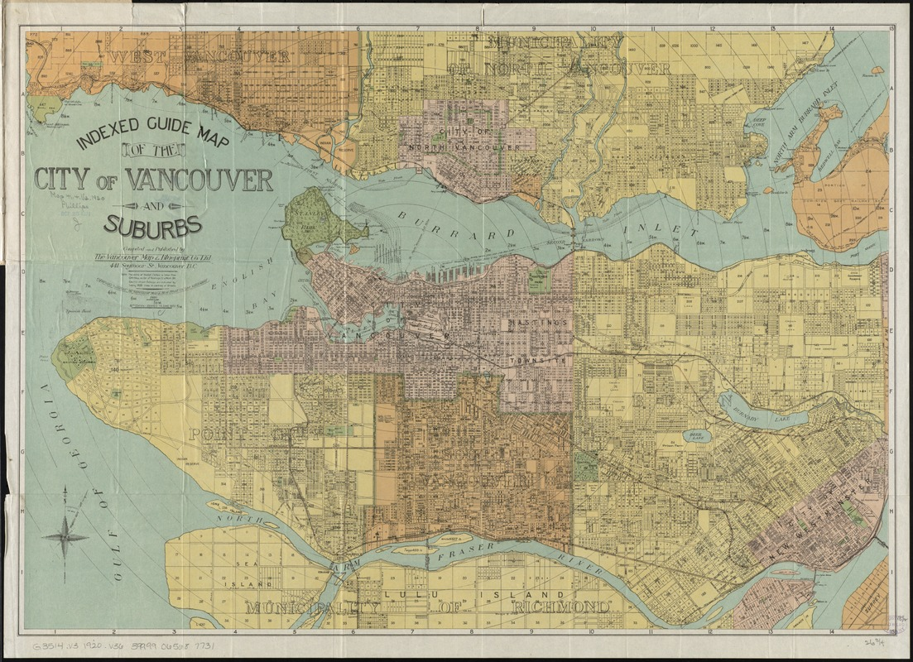
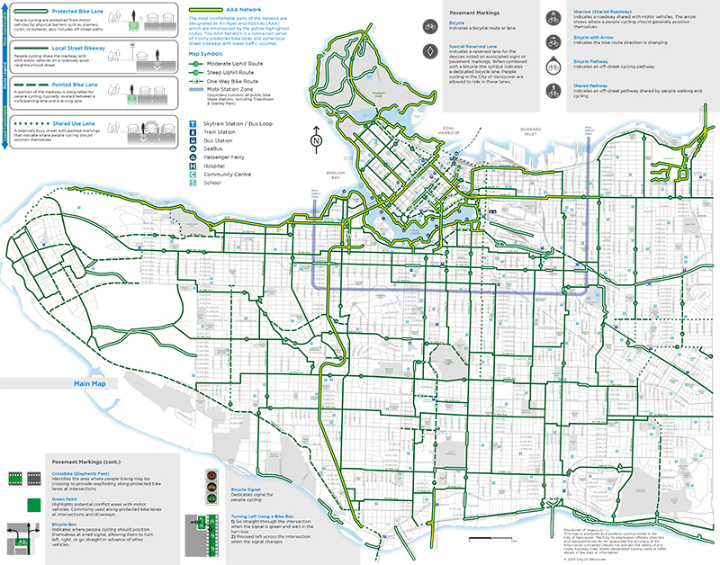

# Digital vs. Web Maps

The term digital map is used quite often, but what does it mean? Wikipedia's entry for "Digital Mapping" is:
> The process by which a collection of data is compiled and formatted into a virtual image.  
However, there are some crucial distinctions between **digital maps** and **web maps**.

## Digital and Scanned Maps
A **digital map** is a map that was somehow derived from a computer. Sometimes we use this term to refer to paper maps which are scanned and reformatted into digital images of maps, like this old map of Vancouver:

    
[Map reproduction courtesy of the Norman B. Leventhal Map & Education Center at the Boston Public Library](https://collections.leventhalmap.org/search/commonwealth:4m90fg11z)     

More commonly, we use this term for "born digital" maps like this cycling map from the City of Vancouver. This map was likely constructed with geospatial data and a Geographic Information System (GIS), and published as a PDF. It visualizes cycling infrastructure at a static scale and dimension.

     

[Front of City of Vancouver Cycling 2019 Map](https://vancouver.ca/streets-transportation/cycling-routes-maps-and-trip-planner.aspx)

## Web Maps
Web maps are a means of *dynamically* and *interactively* visualizing geospatial data. **Geospatial data**, or simply spatial data, is data that includes stored geographic information, such as coordinates. Technically, a web map is a type of digital map since it is derived from a computer. However, there are some important differences:
- **Dynamic scales and content** Web maps are not static images. Different scales display varying levels of detail. For instance, zooming in may reveal information that wasn't apparent before. For this reason, web maps are not designed for print.
- **Interactive** Web maps are built to be interacted with by an end user, often in order for the user to explore a dataset and learn something. Take for example Climate Central's [Surging Seas Risk Zone Map](https://ss2.climatecentral.org/#12/40.7298/-74.0070?show=satellite&projections=0-K14_RCP85-SLR&level=5&unit=feet&pois=hide). Or, listen to the radio anywhere in the world with [radio.garden](http://radio.garden/visit/vancouver/Lc5d7EdP)
- **Display real-time data updates** Web maps are useful for geovisualizing real-time data like weather. Watch [the wind blow across the country.](https://www.ventusky.com/?p=43.8;-97.3;5&l=temperature-2m)
- **Often rely on web and mobile technology** Web maps are ubiquitous - we see and use them all the time. For example, [Google Maps](https://www.google.ca/maps). For small businesses, web maps are helpful for [finding directions](https://luppolobrewing.ca/contact/). For app builders, web maps might provide a [method for routing to locations](https://www.pogomap.info/) using a mobile device's geolocation features. For researchers, they may help [communicate important information](https://www.uvic.ca/research/centres/cisur/projects/map/index.php) in an area of study. For journalists, they may give spatial context to a story like [where Amazon locates its warehouses and why](https://storymaps.arcgis.com/stories/144d21045a794cf8b7834b0c49fdd0c0).
