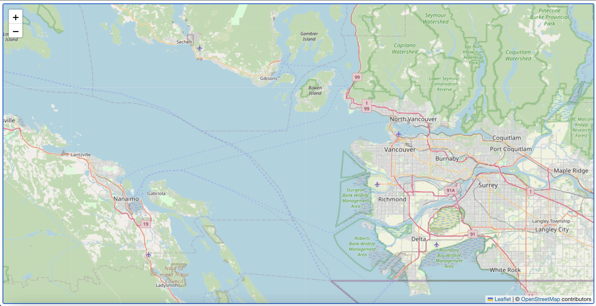
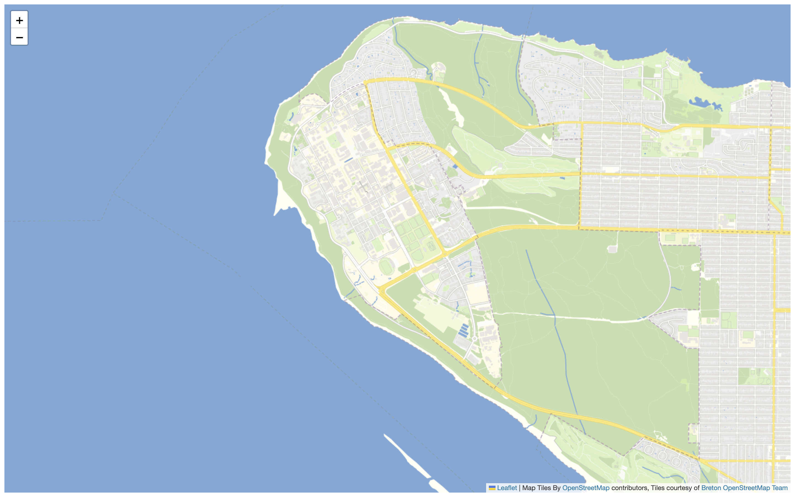

# Map Parameters: A closer look at the script
<br>
The interaction seen in web maps is powered by [JavaScript](https://www.w3schools.com/Js/). There are JavaScript libraries for ALL SORTS of things, and we’re using Leaflet as a foundation for our maps. However you can add customization to your map so that it can do just about anything.

In the last few pages, we got to see the boilerplate basemap in action, learned about the map tiles that are dynamically loaded zoom in and out, and familiarized ourselves with the anatomy of the HTML document that's powering this interactivity. Now, let's take a closer look at the script element to understand how the boilerplate basemap works. 

Everything you add to the boilerplate during this workshop will be within the script tags. Let's take a closer look at what's already there and modify each parameter to see how customizable even the basemap can be. 


```js
    // Initialize your map
    var mymap = L.map('mapid').setView([49.489, -123.801], 9);

    //Load the tile layer
    var osm = L.tileLayer('https://tile.openstreetmap.org/{z}/{x}/{y}.png', {
      attribution: '&copy; <a href="https://www.openstreetmap.org/copyright">OpenStreetMap</a> contributors',
    }).addTo(mymap);
```

## Map Variable

```js
var mymap = L.map('mapid').setView([49.489, -123.801], 9);
```
The first line is our map variable. A JavaScript variable is something that holds values, and our mymap variable holds values for the initial starting view location and zoom level of the loading map.


## Tile Layer 
The other variable `osm` hold values for the map tile layer that we are using for our base layer including where the tiles are coming from, a limit on the max and min zoom level, and attribution.
```js
    var osm = L.tileLayer('https://tile.openstreetmap.org/{z}/{x}/{y}.png', {
      attribution: '&copy; <a href="https://www.openstreetmap.org/copyright">OpenStreetMap</a> contributors',
    }).addTo(mymap);
```


## Configure the Starting View
In the <code>mymap</code> variable you can see a couple of recognizable elements - most noticeably the latitude and longitude coordinate pair [49.489, -123.801]. That location is the geographic center point for the city of Vancouver. When your browser loads the map, it starts with that point in the center of your screen.

Say we want to load the map over UBC, which is about 5 km to the west. We'd need to change that coordinate pair to be the center point of UBC. There are several ways to find this, but an easy one is to use [latlong.net](https://www.latlong.net/). You can also go to Google Maps, and right-click anywhere to copy the coordinates. Remember, these are specific to the projection used by that webmap. Both Google Maps and Leaflet use the same coordinate reference system (WGS84 Web Mercator) so you're all set. 


To Do
{: .label .label-green }
Modify the coordinate pair so your map loads over Vancouver. If Live Server is enabled, you should immediately see the results of this change. Otherwise, save your HTML file, and reload your browser. If everything went as planned, you should see this:




If you don't see a map like the one above, undo your edit in your source code editor (**ctl + z**), and save (**ctl + s**) when it's working again. At that point try again making sure your code syntax is exactly as shown:

```js
var mymap = L.map('mapid').setView([49.2521, -123.0981], 9);
```

## Zoom Levels
Your map currently loads at a zoom level which requires a user to zoom in immediately toward Vancouver. Ideally, if this map is meant to show information for Vancouver, it would load as close to the city as possible, but not so close that different screen dimensions cut off parts such as Stanley Park. So, we'll need to change the loading zoom level.


To Do
{: .label .label-green }
Looking again at our <code>mymap</code> variable, the loading view is set at the coordinate pair over Vancouver now, and at a zoom level of 9. Try increasing or decreasing the zoom level until your map loads on Vancouver. Note that in Leaflet, you must choose discreet zoom levels and whole numbers. 


You should see this if you save and refresh your map:




## Change Base Map

Suppose we want our data to stand out from the green base map more than it does now. One thing we can do is change the source of the map tiles to one that has a more appropriate style for our blue data. As mentioned earlier, there are several out of the box options to choose from with a variety of different styles. [This page lists a number of different map tile sources](https://leaflet-extras.github.io/leaflet-providers/preview/), and provides the text to paste into our map document for each one (minus the important <code>.addTo(mymap)</code> which needs to be inserted before the final semi-colon). **some of these sources require an access token or api-key, so you won't be able to use them unless you sign up for an account**. 

    
The boilerplate basemap works well for this workshop, but try playing around with different tile layers. 


To Do
{: .label .label-green }
Experiment with different basemaps! If you don't know where to start or keep getting a syntax error, try copying one of the code blocks below and replacing the existing map tile variable in your HTML document with it.


```js
var Stadia_StamenWatercolor = L.tileLayer('https://tiles.stadiamaps.com/tiles/stamen_watercolor/{z}/{x}/{y}.{ext}', {
      minZoom: 1,
      maxZoom: 16,
      attribution: '&copy; <a href="https://www.stadiamaps.com/" target="_blank">Stadia Maps</a> &copy; <a href="https://www.stamen.com/" target="_blank">Stamen Design</a> &copy; <a href="https://openmaptiles.org/" target="_blank">OpenMapTiles</a> &copy; <a href="https://www.openstreetmap.org/copyright">OpenStreetMap</a> contributors',
      ext: 'jpg'
    }).addTo(mymap);
```   


```js
var Stadia_StamenTonerLite = L.tileLayer('https://tiles.stadiamaps.com/tiles/stamen_toner_lite/{z}/{x}/{y}{r}.{ext}', {
	minZoom: 0,
	maxZoom: 20,
	attribution: '&copy; <a href="https://www.stadiamaps.com/" target="_blank">Stadia Maps</a> &copy; <a href="https://www.stamen.com/" target="_blank">Stamen Design</a> &copy; <a href="https://openmaptiles.org/" target="_blank">OpenMapTiles</a> &copy; <a href="https://www.openstreetmap.org/copyright">OpenStreetMap</a> contributors',
	ext: 'png',
      scrollWheelZoom: false,
    }).addTo(mymap);
```    

If it all went as planned, you should see the new basemap rendered by your browser. 


