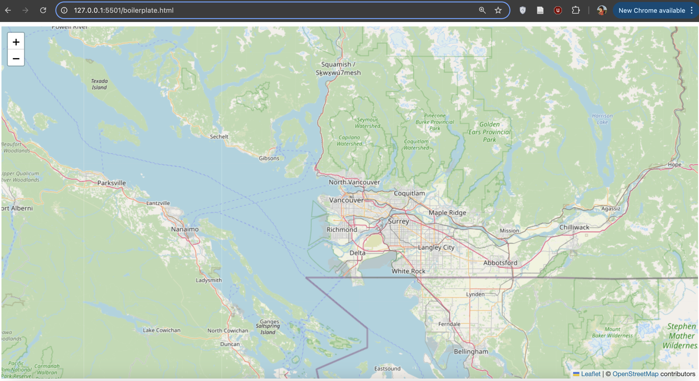

# Map Parameters: A closer look at the script
<br>
The interaction seen in web maps is powered by JavaScript. There are JavaScript libraries for ALL SORTS of things, and we’re using Leaflet as a foundation for our maps. However you can add customization to your map so that it can do just about anything (remember those plugins?).

Let's see how each element of the boilerplate basemap works. 

For this workshop, we’re not creating any new code or writing new scripts. Instead, we’re going to copy and paste some pre-assembled text so that you can see how it works to build your map. Everything you add to the boilerplate during this workshop will be within the script tags. Let's take a closer look at what's already there and modify each parameter to see how customizable even the basemap can be. 


```js
var mymap = L.map('mapid').setView([49.2827, -123.1207], 11);

var OpenStreetMap_BZH = L.tileLayer('https://tile.openstreetmap.bzh/br/{z}/{x}/{y}.png', {
      attribution: 'Map Tiles By <a href="https://www.openstreetmap.org/copyright">OpenStreetMap</a> contributors, Tiles courtesy of <a href="http://www.openstreetmap.bzh/" target="_blank">Breton OpenStreetMap Team</a>',
      subdomains: 'abcd',
      minZoom: 0,
      maxZoom: 20,
      ext: 'png',
      scrollWheelZoom: false,
    }).addTo(mymap);
```

## Map Variable

```js
var mymap = L.map('mapid').setView([49.2827, -123.1207], 11);
```
The first line is our map variable. A JavaScript variable is something that holds values, and our mymap variable holds values for the initial starting view location and zoom level of the loading map.


## Tile Layer 
The other variable `OpenStreetMap_BZH` hold values for the map tile layer that we are using for our base layer including where the tiles are coming from, a limit on the max and min zoom level, and attribution.
```js
var OpenStreetMap_BZH = L.tileLayer('https://tile.openstreetmap.bzh/br/{z}/{x}/{y}.png', {
      attribution: 'Map Tiles By <a href="https://www.openstreetmap.org/copyright">OpenStreetMap</a> contributors, Tiles courtesy of <a href="http://www.openstreetmap.bzh/" target="_blank">Breton OpenStreetMap Team</a>',
      subdomains: 'abcd',
      minZoom: 0,
      maxZoom: 20,
      ext: 'png',
      scrollWheelZoom: false,
    }).addTo(mymap);
```


## Configure the Starting View
In the <code>mymap</code> variable you can see a couple of recognizable elements - most noticeably the latitude and longitude coordinate pair (49.2827, -123.1207). That location is the geographic center point for the city of Vancouver. When your browser loads the map, it starts with that point in the center of your screen.

Say we want to load the map over UBC, which is about 5 km to the west. We'd need to change that coordinate pair to be the center point of UBC. There are several ways to find this, but an easy one is to use [latlong.net](https://www.latlong.net/). Type in UBC in latlong.net, and you return a coordinate pair of (49.260605,-123.245995).


To Do
{: .label .label-green }
Modify the coordinate pair so your map loads over UBC. If Live Server is enabled, you should immediately see the results of this change. Otherwise, save your HTML file, and reload your browser. If everything went as planned, you should see this:




If you don't see a map like the one above, undo your edit in your source code editor (**ctl + z**), and save (**ctl + s**) when it's working again. At that point try again making sure your code syntax is exactly as shown:

```js
var mymap = L.map('mapid').setView([49.260605, -123.245995], 11);
```

## Zoom Levels
Your map currently loads at a zoom level which requires a user to zoom in immediately toward UBC. Ideally, if this map is meant to show information for UBC's campus, it would load as close to campus as possible, but not so close that different screen dimensions cut off parts of the campus area. So we'll need to change the loading zoom level.

Looking again at our <code>mymap</code> variable, the loading view is set at the coordinate pair over UBC, and at a zoom level of 11. In our case, the map best loads at zoom level 14.


To Do
{: .label .label-green }
Change your loading zoom level your map loads at zoom level 14.    


You should see this if you save and refresh your map:


## Change Base Map

Suppose we want our data to stand out from the green base map more than it does now. One thing we can do is change the source of the map tiles to one that has a more appropriate style for our blue data. As mentioned earlier, there are several out of the box options to choose from with a variety of different styles. [This page lists a number of different map tile sources](https://leaflet-extras.github.io/leaflet-providers/preview/), and provides the text to paste into our map document for each one (minus the important <code>.addTo(mymap)</code> which needs to be inserted before the final semi-colon). **some of these sources require an access token or api-key, so you won't be able to use them unless you sign up for an account**. 

    
The boilerplate basemap works well for this workshop, but try playing around with different tile layers. 


To Do
{: .label .label-green }
Copy the text below and replace the existing map tile variable in your HTML document.


```js
var Stadia_StamenTonerLite = L.tileLayer('https://tiles.stadiamaps.com/tiles/stamen_toner_lite/{z}/{x}/{y}{r}.{ext}', {
	minZoom: 0,
	maxZoom: 20,
	attribution: '&copy; <a href="https://www.stadiamaps.com/" target="_blank">Stadia Maps</a> &copy; <a href="https://www.stamen.com/" target="_blank">Stamen Design</a> &copy; <a href="https://openmaptiles.org/" target="_blank">OpenMapTiles</a> &copy; <a href="https://www.openstreetmap.org/copyright">OpenStreetMap</a> contributors',
	ext: 'png',
      scrollWheelZoom: false,
    }).addTo(mymap);
```    

If it all went as planned, you should see the new basemap rendered by your browser. 
