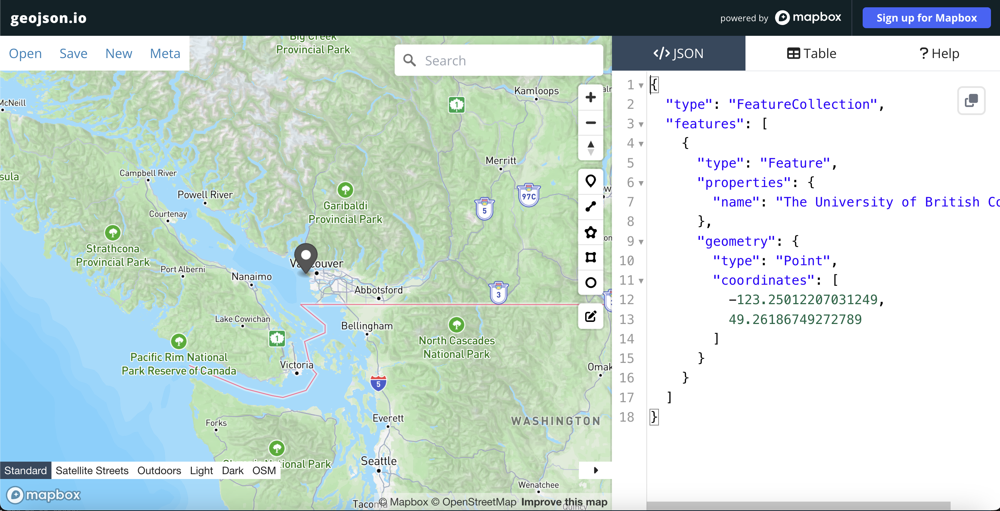

# Map Data
Another component of a web map is the data added to it. While your map tiles are a necessary part of your map, they're really there to provide reference to your data. Your data sits on top of your basemap. We call this your "data layer", "map content" and sometimes your "map features". Most of the time, your data is vector data so you can click and interact with it, but you can also add raster data as well (see [Next Steps](./next-steps.md)).     

If you’re a GIS user, you have encountered a Shapefile. Shapefiles are the industry standard file type for geographic vector data. If you’ve ever tried to share a Shapefile in the web, you’ve probably had some problems, or needed to transform your file into something else. Shapefiles are meant to be used in GIS and other software and weren’t designed to be displayed in the web. [GeoJSON](https://geojson.org/) on the other hand, are geographic files which are meant for the web. They’re “easy for humans to read, and easy for machines to read”, meaning that they’re a lightweight, simplified format so your average web browser can use them, and they’re also fairly easy to understand if you want to view and edit them in a code editor. Here’s a GeoJSON point over UBC:

```json
    {
      "type": "Feature",
      "properties": {
        "name": "The University of British Columbia"
      },
      "geometry": {
        "type": "Point",
        "coordinates": [
          -123.25012207031249,
          49.26186749272789
        ]
      }
    }
```
In contrast, a shapefile is a binary (0s and 1s, not text) format, so you wouldn't be able to read the file with human eyes. For these reasons, we're using GeoJSON files for this workshop.

One other great thing about GeoJSON, is that because they are open-source and simple to understand, there are several tools that allow you to create and edit them in the web, like [geojson.io](http://geojson.io).

To Do
{: .label .label-green }
1. Delete existing geoJSON text on the </>JSON panel of [geojson.io](http://geojson.io).
2. Copy the GeoJSON text above and replace what you just deleted on geojson.io.
3. Click the edit layer button to view the feature properties.
4. You can add or edit the feature's properties there, or directly edit the GeoJSON file's attributes in the Table panel. 



If you look to the bottom left corner of this map you'll see its powered by Mapbox. [Mapbox](https://www.mapbox.com/) is an elaboration on Leaflet's original code library, and now includes products such as toolkits for mobile app development, navigation, web maps, and data management. Mapbox’s service model is based on a paid subscription, but they offer a free service tier for those interested in using Mapbox products for learning. Check out the Research Commons' workshop [An Introduction to Mapbox](https://ubc-library-rc.github.io/intro-mapbox/) if you are interested in learning more.


---
## Some notes on data
-  mention - layers in geojson HAVE TO BE wgs84, and then wrap as variable (show how) --> show how to style too the polygons!! 