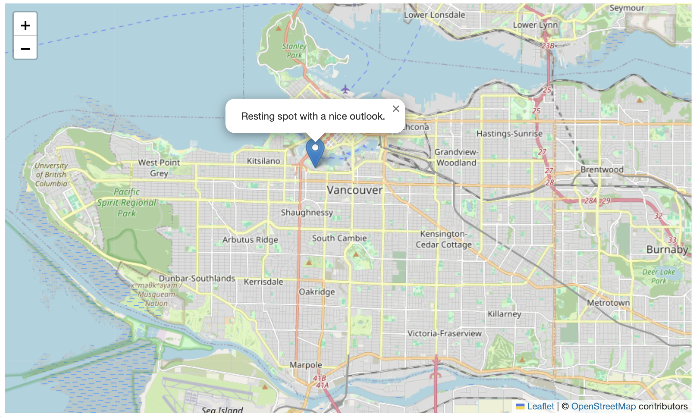

# Adding Data
{: .no_toc}
It's now time to add some map features! In this section, you will be shown how to add a single marker, a point data layer, and a polygon layer. You will also be shown how to change their styling. The data for this workshop can be found in the `webmapping-workshop` folder, which should already be open in VSCode. The point layer `community-gardens.js` and the polygon layer `parks-polygon.js` were downloaded from Vancouver's [Open Data Portal](https://opendata.vancouver.ca/explore/?disjunctive.features&disjunctive.theme&disjunctive.keyword&disjunctive.data-owner&disjunctive.data-team&sort=modified). 


<details open markdown="block">
  <summary>
    On this page:
  </summary>
  {: .text-delta }
 - TOC
{:toc}
</details>
----

## Add a single marker
First things first, let's add a single marker. We will add a marker for a nice resting spot on False Creek. Once you've learned how to add a marker, you are encouraged to add a second marker that corresponds to another spot you like. If you happen to have an image of/from that location, add that to your `webmapping-workshop` folder now as we'll add it to the marker's pop-up later on. 

To Do
{: .label .label-green }
Add a Leaflet marker by copy/pasting the following code into the <code>script</code> element of your map boilerplate HTML document.

Copy/paste
{: .label .label-purple }
```js
var outlook = L.marker([49.26711745383916, -123.13196318772637]).addTo(mymap).bindPopup("Resting spot with a nice outlook.");
```    
You should see something like this (click on the marker too!):    



----

## Add a point layer 
Now let's add a point layer representing community gardens across Vancouver. 
The data layer already exists for us in the `webmapping-workshop` folder. Double click it to open it. If needed, right-click anywhere in the document and "Format Document". 

 

> **Note:** While the data was downloaded from Vancouver Open Data Portal in `.geojson` format, and you can comprehend each feature, you'll notice the filetype is `.js`. This is because the entire geoJSOn dataset was "wrapped as a variable", specifically `communityGardens`, and saved as a JavaScript file. This allows us to reference the dataset as a variable in our web map. To "wrap a geoJSON dataset as a variable", all that was done was to add `var communityGardens = ` to the beginning of the dataset, and then the dataset was "Saved as" a JavaScript file type. The data itself is still in geoJSON, it's just nicely packaged for us now. In the [Practice](./practice.md) section, you'll try doing this yourself. 

<br>
Though data layers are more complex than single markers, we add them to a web map in a similar manner: by creating a new variable holding the values for the GeoJSON feature(s).    

To add a point layer of community gardens to your web map of Vancouver, copy and paste the following line of code *below your marker(s)*.

Copy/paste
{: .label .label-purple}
```js
L.geoJson(communityGardens).addTo(mymap);
```    

At first, nothing will show up. This is because we need to do one more thing. We need to **link all datasets referenced in the head element** of the web map. Copy and paste the following code at the very end of your web map's `<head>` element. 

Copy/paste
{: .label .label-purple}
```html
<script src="./community-gardens.js" charset="utf-8"></script>
```
<br>

Your web map should now look something like this:   


<br>

Notice the data source we added in the `<head>` element locates the dataset in `./community-gardens.js`. The `./` preceding the filename denotes a relative path. A [relative path](https://www.w3schools.com/html/html_filepaths.asp) is a path to a file that is in the same folder as your HTML document. If your data were stored in downloads, for instance, the source link would look like `src="./downloads/community-gardens.js"`. If your data were stored on a server or hosted by an external web source, as are the CSS and Javascript, the source link would direct the web browser reading and rendering your map's HTML document to that address. 
{: .note}
<br>

----


## Add a polygon layer
Adding a polygon layer is similar to adding a point layer. First, check the data file `parks-polygon.js` and note that the geoJSON data has been wrapped as a JavaScript variable called `parks`. 

First, add a link to the data source in your web map's `<head>` element:
    
Copy/paste
{: .label .label-purple}
```html
<script src="./parks-polygon.js" charset="utf-8"></script>
```
<br>
Then, add `parks` as a data layer in the `<script>` element below your marker and point layer:

Copy/paste
{: .label .label-purple}
```js
L.geoJson(parks).addTo(mymap);
```
<br>  

If all went well, your map should now look like this: 

<br>

If you find it busy, you can always remove the `L.geoJson(communityGardens).addTo(mymap);` line that loads community gardens, or "comment it out" by hitting `command + /`. 
<br>

## Styling polygons

Perhaps you want to change the way parks polygons are styled. For example, we could change them to be a solid color such as green. This way, they'd stand out against the basemap. 

to change the styling of a polygon data layer, we will 1) write a *function* that styles a specific layer, in this case `parks`, and 2) add our new style as an option to that data layer. A *function* in programming is a block of code that does some specific task, like a mini program. In your web map HTML boilerplate document, replace the line of code for parks with the following:

```js
 L.geoJson(parks, {style: style}).addTo(mymap);

    function style(feature, parks) {
      return {
        fillColor: '#2aa858',
        color: '#71c791',
        weight: .5,
        fillOpacity: 0.8
      };
    }
```

There, we have created a style function that looks at every feature in the `parks` dataset and gives it a `fillColor` of `#2aa858`, which is the [HEX code for green](https://www.google.com/search?q=hex+color+picker&oq=hex+color+picker&aqs=chrome..69i57j35i39j0i67i131i433j0i67i433j0i433i512j0i67j0i512j0i131i433i512j0i512l2.1699j0j7&sourceid=chrome&ie=UTF-8). `color` dictates the color of each feature's outline, and `weight` is the thickness of those outlines. `fillOpacity` is the transparency of the shading, where 0 is completely transparent and 1 is completely solid. Take a moment to play around with the color of the parks layer.
<br>

