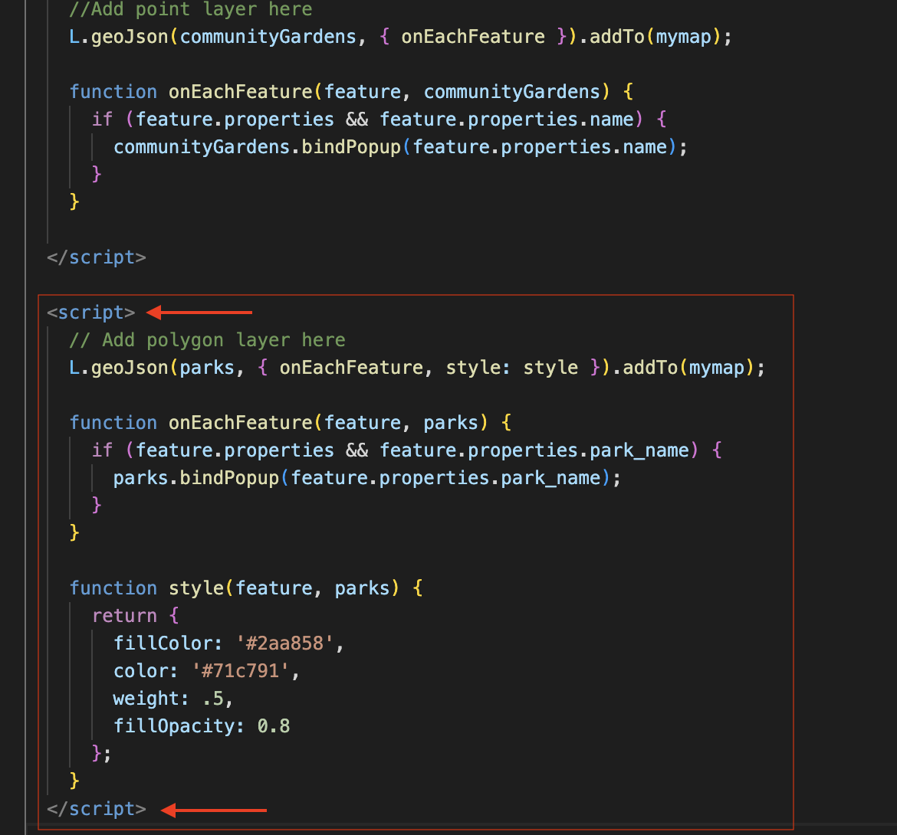

# Configure Popups
{: .no_toc}

Both the community gardens and parks layers contain attribute values for each feature. We got a glimpse of these when looking at the datasets in VSCode. Currently, if we click on the features in our web map we cannot view this information because we haven't yet configured our map to load pop-ups for each layer. To add pop-ups with specified attribute information, we'll need to add more functions. 

Below, you'll be shown how to add pop-ups to the point layer, the polygon layer, and an image to the original single marker layer. 

<!-- - look into adding /including photo in popup. maybe do for one place, like jrogers swings. 

- add popups for differen things... show how to have pooputs for points and polygons by creating new script element. 

- - do custom marker text for community gardens.  -->

<details open markdown="block">
  <summary>
    On this page:
  </summary>
  {: .text-delta }
 - TOC
{:toc}
</details>
----


## Naming Community Gardens
Let's begin by adding the names of community gardens as pop-ups to our web map. We know from looking at the data layer in VSCode that the value for each garden's name is contained in the attribute titled `name`.


<br>

The function we'll use to add pop-ups to each feature is called `onEachFeature`.  Then, just like when styling the parks, we have to add an option `{onEachFeature}` to the code that loads the data layer that references this new function. In your web map's HTML document, replace the code for community gardens point layer with the following:


Copy/Paste
{: .label .label-purple }

```js
  L.geoJson(communityGardens, {onEachFeature }).addTo(mymap);

    function onEachFeature(feature, communityGardens) {
      if (feature.properties && feature.properties.name) {
        communityGardens.bindPopup(feature.properties.name);
      }
    }
```


<br>

If all went well, the name of each community garden should popup when you click. 
<br>


## Naming Parks
Naming polygons is the same as naming points. Replace the line of code that loads your parks layer with the following (but keep the styling function as is). 


Copy/Paste
{: .label .label-purple }
```js
L.geoJson(parks, { onEachFeature, style: style }).addTo(mymap);

    function onEachFeature(feature, parks) { 
      if (feature.properties && feature.properties.park_name) { 
        parks.bindPopup(feature.properties.park_name);
       } 
      }
```

<br>
**Note:** You'll notice that once you add pop-ups for parks, the pop-ups for community gardens no longer work. To solve this, we can just create a new `<script></script>` element underneath our current one, and copy/paste all the code for parks, including the styling function, into this new element. 



<br>

## Elaborating Pop-ups
Perhaps you want to convey more information in a pop-up than the name of each feature. If you want to add more than one attribute, you can string them together like so:

Copy/Paste
{: .label .label-purple }
```js
L.geoJSON(communityGardens, {
      onEachFeature: function (feature, communityGardens) {
        var popupContent =
          "<b>Name: </b>" +
          feature.properties.name +
          "<br><b>Number of Plots: </b>" +
          feature.properties.number_of_plots
          ;

        communityGardens.bindPopup(popupContent);
      },
    }).addTo(mymap);
```

<br>


## Adding images to pop-ups
Finally, here's how you add an image to a single marker. For demonstration purposes, we will add the image `outlook.jpg` from the workshop data folder to the stand-alone marker we first added to the map. 

First, we'll create a variable for the marker's popup, setting the source link to the file path of the image. We'll also dictate the width of the image here. Then, we'll create a second variable that dictates the height and width of the pop-up itself. Finally, we'll add a marker that takes both variables in as parameters.

So, **delete** the line 
```js
var outlook = L.marker([49.26711745383916, -123.13196318772637]).addTo(mymap).bindPopup("Resting spot with a nice outlook.");
```
and **replace it** with the following code:

Copy/Paste
{: .label .label-purple }
```js
 var outlookPopup = "<br>Resting spot with an outlook";

    // specify popup options 
    var outlookOptions =
    {
      'maxWidth': '210',
      'className': 'custom'
    }

    L.marker([49.26711745383916, -123.13196318772637],).bindPopup(outlookPopup, outlookOptions).addTo(mymap);
```
<br>

Consider commenting out the community gardens layer so you can see whether your addition was successful. 
<br>


<br>

Congratulations! You have successfully created a web map!