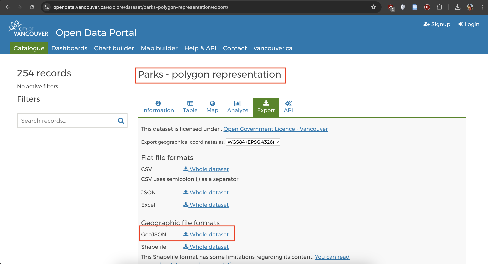

# Practice
Practice what you've learned in this workshop by choosing a dataset from Vancouver’s [open data portal](https://opendata.vancouver.ca/explore/?disjunctive.features&disjunctive.theme&disjunctive.keyword&disjunctive.data-owner&disjunctive.data-team&sort=modified) to add to your webmap. You will need to download the dataset in GeoJSON format, move it to your `intro-leaflet-data` folder, wrap it as a javascript variable, and add as both a a data source and a data layer to your html document. 

Note: You may need to change your map centering and zoom level so Vancouver comes into the frame. 

Take a moment to practice on your own, or refer to the hints below. 

1. For example, download [Vancouver Parks](https://opendata.vancouver.ca/explore/dataset/parks-polygon-representation/export/) (polygon representation) from the Open Data Portal. 


2. Move the download file, `parks-polygon-representation.geojson` to your workshop folder, `intro-leaflet-data`. It's important your data be in the same folder of your webmap's html document. 
    

3. Open the dataset in VS Code. It will either appear in your Contents after you add it to your working folder, or you can right-click it from your computer and open it with VS Code. 
    

4. It will look like a wall of code. Right-click anywhere on the page and format it. 

    

5. Now wrap it as the variable `vanparks`

    

6. You'll notice the name of the document becomes red, signifying there's a syntax error somehwere in the document. There isn't. Rather, you have formatted the document as javascript, but the file extension is still GeoJSON. Save your work (hit Ctrl + S) and return to your `intro-leaflet-data` on your computer. Rename the file  Rename the file and file extension: `vanparks.js`. 


7. Return to VS Code and open the new dataset, `vanparks.js`. Everything should be in order now with no warnings. 


8. Now, return to your `boilerplate.html` document in VS Code. In the `<head>` tag, add a line beneath your current data source that directs your map to your new data source: 
```
<script src="./vanparks.js" charset="utf-8"></script>
```

9. Then, in the `<script>` tag of the body element, add a function to add your second data source as a layer: 
```
L.geoJSON(vanparks).addTo(mymap);
```

10. Save your html file and go to your Live Server. Zoom out and pan to Vancouver. You should see your data layer added to the map. 


# Adding more elements 
You may want to add a legend or title, cluster data, or further style your map. While [Leaflet Docs](https://leafletjs.com/reference.html) documents how to do much of this, there is a wealth of documentation online from people tweaking given code to meet their specific needs. So, if you have something specific in mind, we recommend you do an internet search to see what's out there you could draw inspiration (and often code) from. 


-- 
could also practice adding different layers that are already prepare d- have different levels of difficulty re practice. 