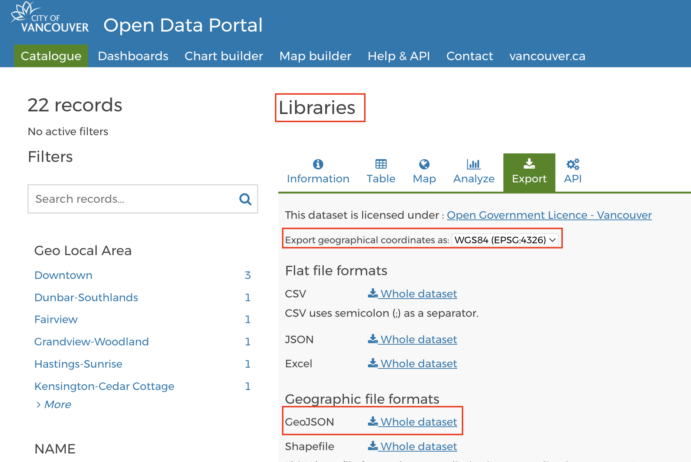
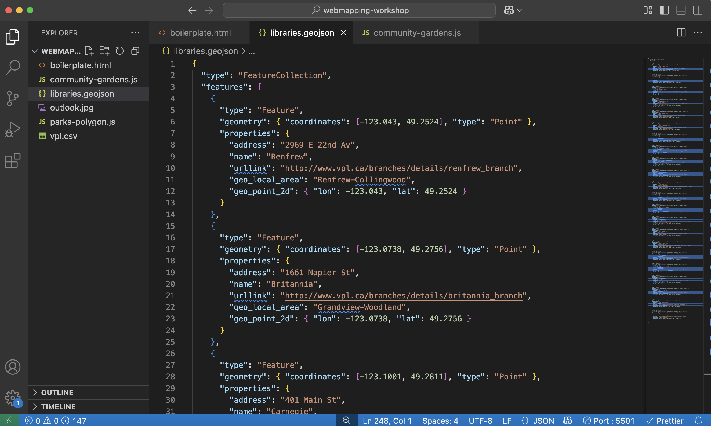
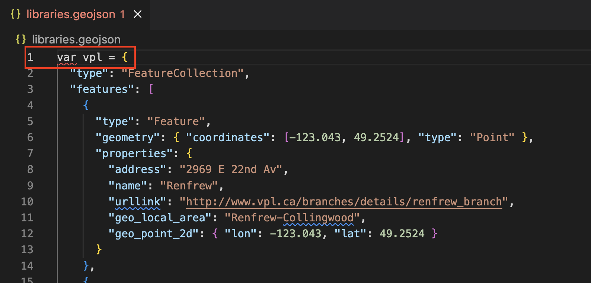
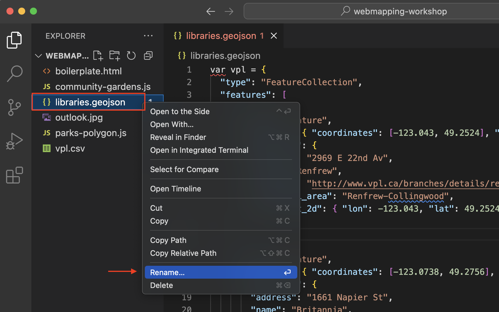
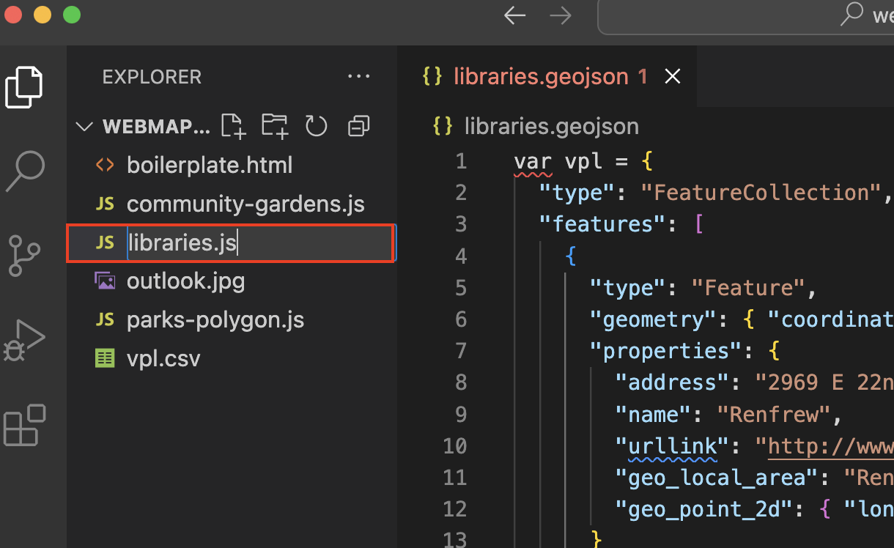
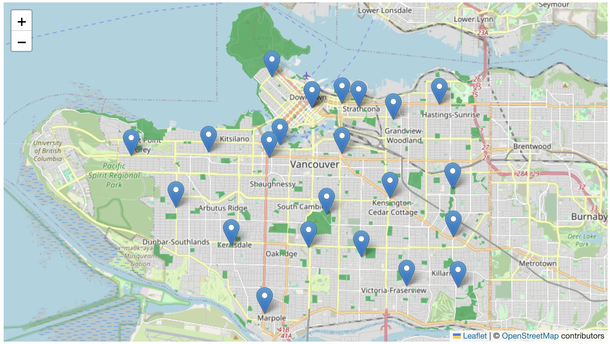

# Practice

## Add another marker
Try adding another stand-alone marker to your map, and adding an image to the popup. 

## Add another dataset
Practice what you've learned in this workshop by choosing a new dataset from Vancouver’s [open data portal](https://opendata.vancouver.ca/explore/?disjunctive.features&disjunctive.theme&disjunctive.keyword&disjunctive.data-owner&disjunctive.data-team&sort=modified) to add to your web map. You will need to download the dataset in GeoJSON format, move it to your `webmapping-workshop` folder, wrap it as a JavaScript variable, and add it as both a data source in the `<head>` element *and* as a data layer in your `<script>` element. 

Take a moment to practice on your own. Reference the hints below if you get stuck. 

1. For example, download [Vancouver Public Libraries](https://opendata.vancouver.ca/explore/dataset/libraries/information/) (polygon representation) from the Open Data Portal. 


2. Move the download file, `libraries.geojson`, to your workshop folder. It's important your data be in the same folder of your web map's HTML document. 
    

3. Open the dataset in VSCode. It will either appear in your Contents after you add it to your working folder, or you can right-click it from your computer and open it with VSCode. 


4. It will look like a wall of code. Right-click anywhere on the page and format it. 

    

5. Now wrap it as the variable `vpl`

    

6. You'll notice the name of the document becomes red, signifying there's a syntax error somewhere in the document. There isn't. Rather, you have formatted the document as JavaScript, but the file extension is still GeoJSON. Rename the file with the proper extension: `vpl.js`. You can do this by simply right-clicking the file in VSCode and choosing to rename it. Then simply replace the extension geojson with js.<Br>
 
 
<br><br>

7. Return to VSCode and open the new dataset, `vpl.js`. Everything should be in order now with no warnings. 


8. Now, return to your `boilerplate.html` document in VSCode. In the `<head>` tag, add a line beneath your current data sources that directs your map to your libraries data: <br>
```html
<script src="./libraries.js" charset="utf-8"></script>
```
<br>

9. Then, in the `<script>` tag of the body element, add a function to add your second data source as a layer: 
<br>
```js
L.geoJSON(vpl).addTo(mymap);
```
<br>
10. Save your HTML file and go to your Live Server. You should see your data layer added to the map. 
<br>

<br>

You can now experiment with adding pop-ups for the libraries. Remember though, you might need to move all your code for libraries into a new script tag if you want your other data layers to maintain their interactivity as well. 
