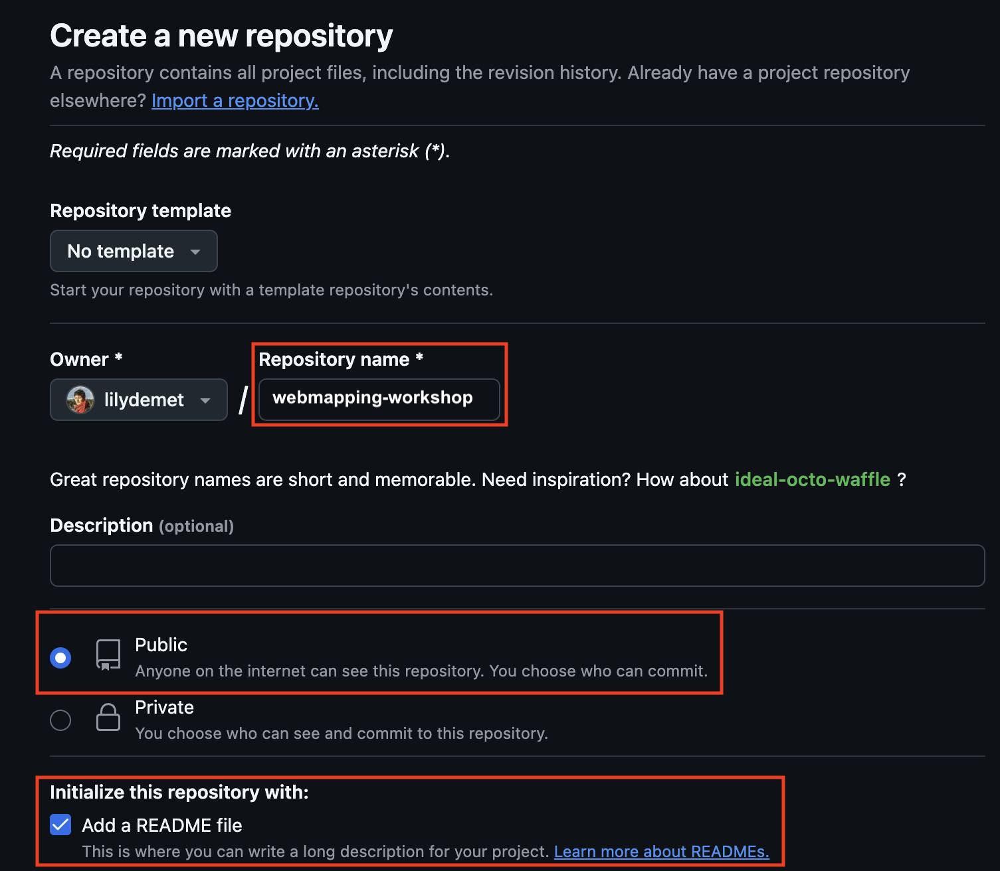

# Optional: hosting your web map with Github

As is, your web map powered by leaflet exists as a folder of files on your physical computer. You can open it locally, but no one else can access it unless you send them the folder to download to their own computer. This is where web hosting platforms come in. If you upload this folder to a cloud service then you can make the map viewable in web browsers anywhere with internet connection (and no access restrictions).

If you have a website and access to local server, that’s an option too. However, if not, Github is a low-barrier solution. Github is an internet hosting service used by code developers that allows you to upload files into a repository, or project folder, where they can be shared and collaboratively tracked and edited by a team. Conventionally you’d work between your local computer and the web account, tracking changes as you go with *git*, a file control software. See the Research Common’s [Introduction to git and Github](https://ubc-library-rc.github.io/intro-git/) for more. However, we can work directly and exclusively from the web interface. The steps to host your dynamic on the web using Github are as follows:

1. Create a free Github account
2. Make a new repository 
3. Upload your data folder to the repository
4. Create an index file
5. Make a Github page from that index file 

Let's take this step by step...

<br>

## 1. Create a Github account
Go to [github.com](https://github.com/) and create a free Github account. 

## 2. Make a new repository
Once you've made an account, go to **Repositories** and make a new repository (also known as a "repo"). A repository is like a folder that contains a project. 


> - Call the repository `webmapping-workshop` followed by your initials.

> - Set the visibility to **Public**.

> - Add a README.md. This is where you can give a brief description of what the project is. 

> 

>- When working on your own projects, if you choose to set a license at this stage, ensure you have permissions to use all the data you do in the way you are licensing it. Never upload confidential datasets to a publicly visible Github repository. 


> - Scroll down to the bottom and **Create repository**.

## 3. Upload your web map folder to your repository

<!-- IMPORTANT: before uploading your webmap folder, delete the numbers trailing the name so that the folder is now named only `qgis2web`.  -->

> - Drag and drop your workshop data folder to upload. 

[ insert image ] like in https://ubc-library-rc.github.io/gis-plugins-qgis/content/hosting-webmap.html

> - When done, scroll down to bottom of screen and commit changes with message `added webmap folder`.

<br>
You should now see your file in your repository:
[insert image]

## 4. Create index file
Now create an index.html file wherein your map can be embedded for display. 

Go to **Add file** and this time select **+Create new file**. Copy and paste the below code into the file:

[edit this]

```html
<!DOCTYPE HTML>
<head>
    <title>workshop webmap</title>
    </head>

<body>
<iframe src="./qgis2web/index.html" style="width:100%; height:700px; border:none;"></iframe>
</body>
</html>
```

Give the file name `index.html` and commit.

[insert image]

<br>

## 5. Make a Github page from the index file
[Github Pages](https://pages.github.com/) allow you to create a little website from a code repository. The non-nested index.html file of your repository will be the landing page of your site. I say non-nested because you have another index.html file inside your workshop/uploaded folder. In the step above, we embedded this inside the main `index.html` file.

To activate Github Pages, go to your repository's **Settings**. 
[image]

<br>

Then go to **Pages**:

[image]

<br>
Change branch from Non to **main** and **SAVE**.

[image]

<br>

Once you hit save, give it a moment to build. After a minute or two, refresh your browser window. You should see a link now to your new website! Visit the site and explore your map once again. Now you can share it far and wide!

[screenshot with link at top highlighted]

One last step:
Copy the link and return to your repo code. In the **About** section at the top right, add this link so that visitors to your repository can also access your website. 