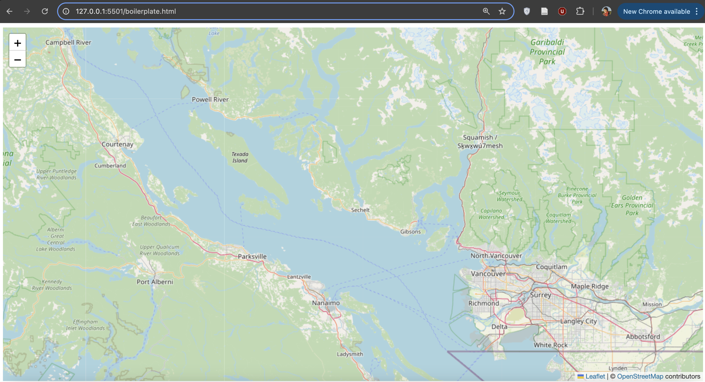
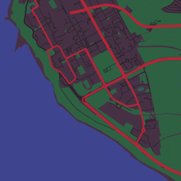
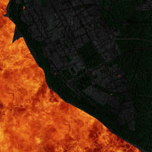
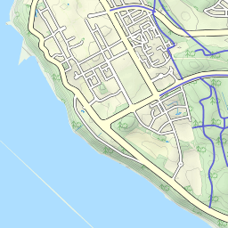
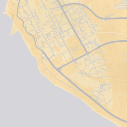
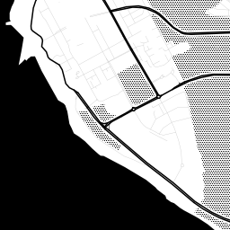
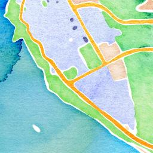

# Leaflet Basemap & Map Tiles
Let’s first see what the basic Leaflet web map looks like. From your computer's finder, locate the file `boilerplate.html` and open it with your web browser of choice (e.g., Google Chrome). To do this, you can likely just double click the file. If that fails, control-click (i.e. right-click) the file and choose your web browser as the application to 'open with'. In your web browser, you should see a map that looks like this:

Keep this browser tab open - we’ll return to it in the next section.

## Map Tiles
**Map tiles** are squares of geographic data that are loaded to your frame of view whenever you zoom or pan your map. Each tile is 256px by 256px (traditionally a .png image at roughly 20-40kb each), making them quick to load over an internet connection. These tiles provide a geographic reference for other data layers that you might add later (we'll get to that in a minute). You've probably noticed them if you've had choppy internet connection and had to wait for data to load:

Every time you pan your map, new tiles are loaded to fill that frame of view. The tiles outside of that view are not loaded because loading the entire world's tiles would be time consuming, especially if you were just focused on a small area. When you zoom in or out, new tiles are loaded to correspond with the level of detail needed at each **zoom level**.

## Zoom Levels

Because web maps refresh content as you zoom in, they don't have a traditional map scale. Instead, there are different levels associated with the amount of detail shown on the map.
Web maps typically have around 20 zoom numbered levels. Zoom level 0 has the least amount of detail, and is from a viewpoint as far away as earth as it gets. As the zoom level number goes up, so does the detail. Zoom level 18 has enough detail that displaying building labels makes sense without a mess (imagine what building labels would look like on a web map zoomed all the way out!). Zoom level 0 consisting of only 1 tile for the entire world (this zoom level loads the fastest!). Zoom level 18 consists of around 69 billion tiles. That's a lot of data!!!!

| Level 0                                             | Level 18                                                     |
| --------------------------------------------------- | ------------------------------------------------------------ |
|  |  |
| 1 tile covers the world                             | 69 billion tiles cover the world                             |

<!-- Here's the map tile grid for **zoom level 11 over Vancouver**:

Here's the map tile grid for **zoom level 13 over Vancouver**:

-->

## Tile Servers

You might be thinking: **_Where are all these tiles loading from?_** Well, there are services that render these tiles for consumption. The main two are Google and [OpenStreetMap](https://wiki.openstreetmap.org/wiki/Tile_servers), but there are many others.

You might also be thinking: **_Can I customize my own tiles to make them look cool?_** You can, with services like [Mapbox Studio](https://www.mapbox.com/mapbox-studio/). Or you can [set up your own server](https://medium.com/@Nithanaroy/create-your-own-tile-server-and-map-client-5f7515fff28) to render your own. But these options are both way beyond the scope of this workshop, so for now, don't worry about it. There are several out-of-the-box options to make your map tiles look sleek.

Here are some interesting styles for the tile covering the south part of UBC Campus at zoom level 13:

  
  

## Raster and Vector Tiles

Another thing to understand about map tiles is that there are both raster and vector tiles. Raster tiles have been around longer, and so are a little simpler to tinker with when beginning to web map. That's why we're using raster tiles for this workshop. Features and attributes on raster tiles are static because such tiles are just images.

Vector tiles contain vector data like feature names and other attribute data. While they have been around for several years, they are still newer and faster, and offer more customization options than raster tiles. These tiles are rendered as soon as your browser requests them from a tile server, freeing us from discrete zoom levels and map orientation. To learn more about vector tiles, we recommend Mapbox's [Vector Tiles Introduction](https://docs.mapbox.com/data/tilesets/guides/vector-tiles-introduction/).
