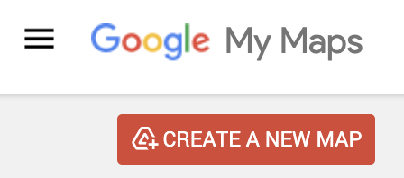
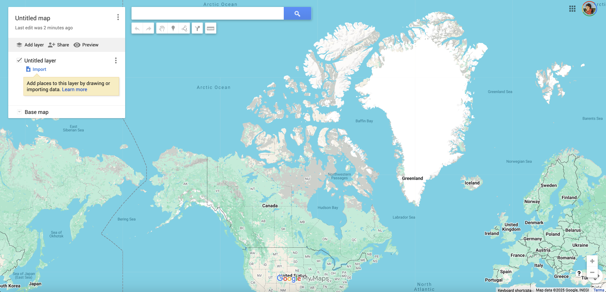
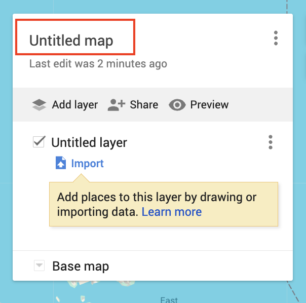
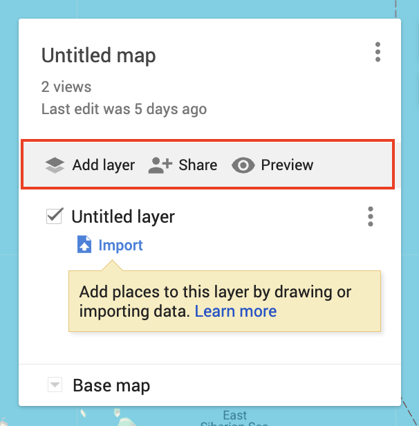
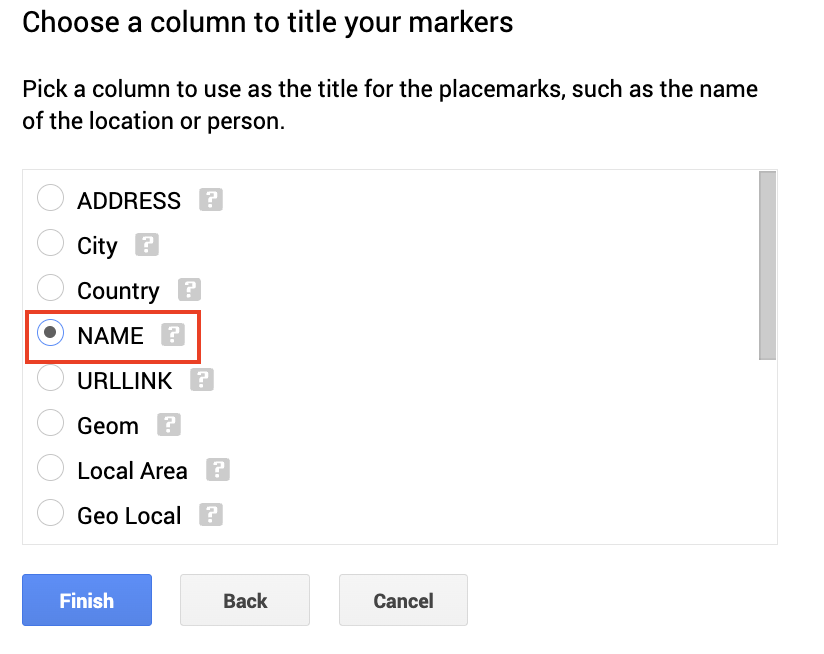
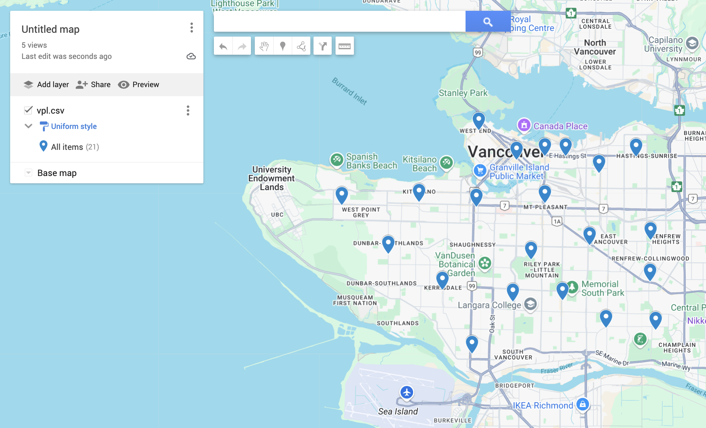

## Google MyMaps Demo
 

-  Go to [Google MyMaps](https://www.google.com/maps/d/u/0/). Create and/or login to your Google Account. 
 

- Click CREATE A NEW MAP  

 

- Once a new map has been created, your screen will look like this. 

 

- The interface is quite intuitive. In the top left-hand corner, there is a white box. The first thing you may notice is that your map is currently Untitled. You can simply click to edit the title. 

 

- Beneath the title is a grey bar with options to "Add Layer", "Share", or "Preview".  
> - **Add Layer** will add additional layers to your map. Note: they will all be empty until you upload data to them. 
> - **Share** allows you to set the sharing options of your map, and send it to others. If you haven't given your map a name and description, you will be prompted to do so before sharing. 
> - **Preview** will give you a glimpse of how your map will look to others. 

 

- Each layer of your map will initially be untitled. You can change the name any time. The check box indicates whether the layer is visible or invisible on the map upon initial load. You can edit or delete a layer by clicking the three dots beside it. Remember that layers are containers for data, and each layer is empty until you upload data to it. 

 

- Lets go ahead and **add data to the map**. Note you can upload limited file types. Let's upload the dataset of Vancouver public libraries inside the `webmapping-workshop` data folder. The file is called `vpl.csv`. 

(show screenshot of dataset here) - taken from website and cleaned a bit - account for errors. 

 To upload, click  and browse to the file. 

You will be prompted to indicate the columns Google MyMaps should use to locate each feature. If you scroll down, lon and lat should be auto-selected. Keep these and click continue. 

Next, you will be prompted to choose the field containing the names of each feature for labelling purposes. It's always good to explore your dataset *before* importing it into any map. We will use `NAME`. Then click Finish. 

If you haven't made a name for the layer, it will automatically take on the name of your uploaded file. 

Right now, the styling of the points representing libraries is uniform. In other words, each drop-pin is the same color, size, shape, etc. We can change the styling by clicking the paint-roller icon 

- **Uniform Style** what we have now
- **Sequence of Numbers**
- **Individual Styles**
- **Style by data column**