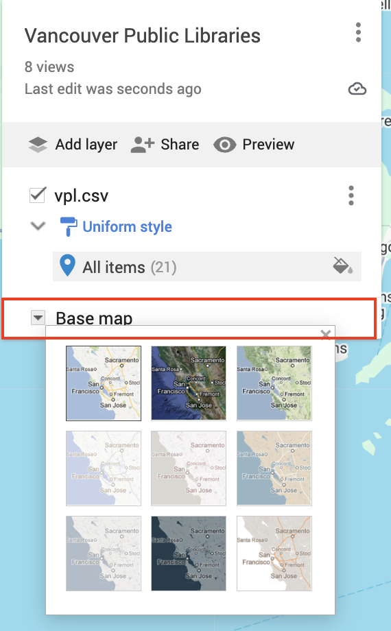

## Google MyMaps Demo
 

1. Go to [Google MyMaps](https://www.google.com/maps/d/u/0/). Create and/or login to your Google Account. 
  

2.  Click CREATE A NEW MAP  
 
  

3. Once a new map has been created, your screen will look like this. 
 
  

4. The interface is quite intuitive. In the top left-hand corner, there is a white box. The first thing you may notice is that your map is currently Untitled. You can simply click to edit the title. 
 
  

5. Beneath the title is a grey bar with options to "Add Layer", "Share", or "Preview".  
 - **Add Layer** will add additional layers to your map. Note: they will all be empty until you upload data to them. 
 - **Share** allows you to set the sharing options of your map, and send it to others. If you haven't given your map a name and description, you will be prompted to do so before sharing. 
 - **Preview** will give you a glimpse of how your map will look to others. 

  

6. Each layer of your map will initially be untitled. You can change the name any time. The check box indicates whether the layer is visible or invisible on the map upon initial load. You can edit or delete a layer by clicking the three dots beside it. Remember that layers are containers for data, and each layer is empty until you upload data to it.     

  

7. Lets go ahead and **add data to the map**. Note you can upload limited file types. Let's upload the dataset of Vancouver public libraries inside the `webmapping-workshop` data folder. The file is called `vpl.csv`. The data was taken from [Vancouver Open Data Portal](https://opendata.vancouver.ca/explore/dataset/libraries/information/) and edited slightly to update library addresses. 
  
 
  
 To upload this dataset to your Google MyMap, click  and browse to the file. 
  
 You will be prompted to indicate the columns Google MyMaps should use to locate each feature. If you scroll down, lon and lat should be auto-selected. Keep these and click continue. 
   
 
  
 Next, you will be prompted to choose the field containing the names of each feature for labelling purposes. It's always good to explore your dataset *before* importing it into any map. We will use `NAME`. Then click Finish.
   
 
  
 If you haven't made a name for the layer, it will automatically take on the name of your uploaded file. 
 
 
  

8. Right now, the drop-pins representing libraries are uniformly styled. This means that each icon is same color, size, shape, etc. We can change the styling of a layer by clicking the paint-roller icon . You can change the styling by grouping places/datapoints in the following ways:

- **Uniform style** What we have now. All points are styled the same. 
- **Sequence of numbers** Data points are each assigned a number
- **Individual styles** Allows you to manually adjust the color and icon for each occurrence. After setting "Group places by" "Individual styles", simply over over any place and click the grey paint icon that appears to the right. 
- **Style by data column** Will assign a random color to occurrence of the column selected. For instance, if we style by the column `NAME`, because each library has a unique name, each drop-pin will become a distinct color. 
  
 
  
In all cases, labels can be set according to any column of your dataset, or set to "No labels". 
 
Furthermore, you can continue to edit the styling individual points/places even after they are styled by data column. For example,

- Click the the paint-roller icon beside a place 
 

- Change the color and icon of a place 
 

- Add an image to a popup 
 
  

Finally, you can choose different basemaps to highlight your data.  
 