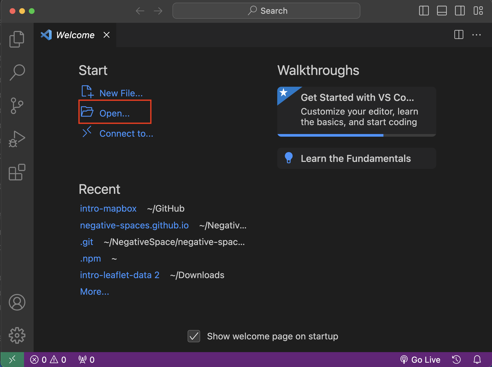
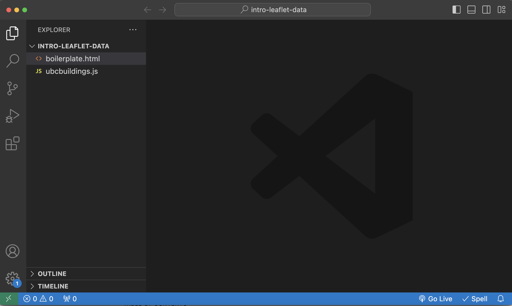

# Open Data in Code Editor

*1*{: .circle .circle-blue} First open the Visual Studio Code (VS Code) application. To open `intro-leaflet-data` with VS Code, select Open... from the Welcome Page and navigate to your data folder is stored on your computer. Select it (but don't click into it) and hit Open. If you are having any trouble, ensure your data folder is unzipped.

 

*2*{: .circle .circle-blue} Once opened, you should see two files in the Explorer panel of your code editor. `ubcbuildings.js` is the data file, and the `boilerplate.html` is the map boilerplate. Double click `boilerplate.html ` in the Explorer panel to open it.
    

    
     
*3*{: .circle .circle-blue}
If you installed the Live Server extension to Visual Studio Code, in the blue ribbon at the bottom of your code editor there should be an option to “Go Live.” Click “Go Live” to launch a local server and watch your map automatically update in a web browser. Note: Depending on your computer’s operating system, you may need to hit Ctrl + S to save your document edits before Live Server will update to reflect your changes. Live Server alleviates the need to constantly refresh your browser each time you make a change.

Because we will be working back and forth between the browser page the code editor, it’s helpful to arrange your computer screen(s) in a way where you can either see both windows at once or are able to toggle between the two. This way, every time you modify the html code you can see the changes in your browser. You’ll also want to have workshop website accessible.