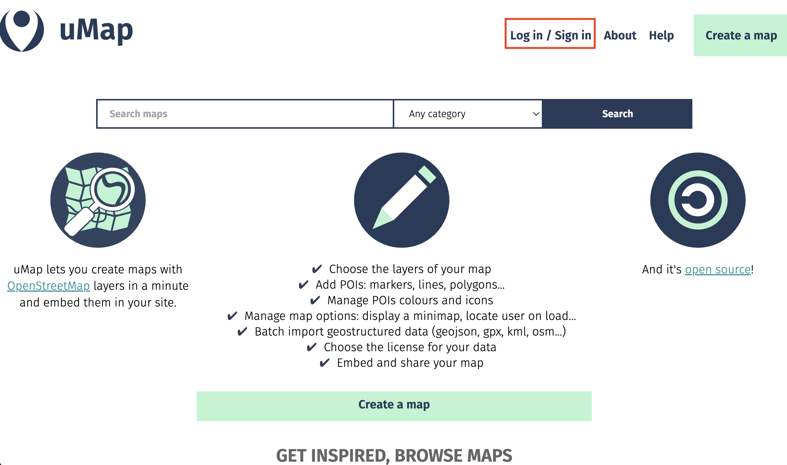

# uMap Demo
 

1. Go to [umap.openstreetmap.fr/en/](https://umap.openstreetmap.fr/en/) and **Log in/Sign in**. This ensures any map/work you create will be saved so you can return to it later. 

  
2. Click **Create a map**.  

  
Here is your working interface. Along the top is a menu bar. You'll notice the visibility is set to private. This will remain so until you go to share it, when you'll be prompted to update visibility settings so anyone can see it. You can give your map a name, save your draft as you're working, and preview it as soon as you make any changes. 
  

  
3. Along the two sides of your screen you'll notice two vertical toolbars. 
  

  
**The toolbar on the left** allows you to zoom in and out, to share and download the map, and to browse any data layers you add. **If you click the drop down arrow even more options will appear.**
 
 -  allows you to center your map on a particular location. Try centering it on Vancouver. To do this, pan/zoom to Vancouver and then click the icon. You can use the magnifying glass tool above to search for a specific location rather than finding it on the map. 
 -  allows you to change the basemap. (You might need to extend your browser window if you can't see all the basemap options.) Try changing the baseamp.
  
4. The toolbar on the right** allows you to add and manipulate data. The first three tools allow you to add markers, lines, and polygons directly to your map. No need to create a data layer elsewhere first. However, if you *have* datasets you want to add to the map, you can upload them.
 
 -  allows you to import datasets. Try importing `neighborhoods.geojson` from the `webmapping-workshop` folder. Notice that in the drop-down menu of "Choose the format", `.js` files are not listed. Each web mapping tool/platform has its own specifications for what data formats can be uploaded and displayed. You can go to the [Vancouver Open Data portal](https://opendata.vancouver.ca/explore/?disjunctive.features&disjunctive.theme&disjunctive.keyword&disjunctive.data-owner&disjunctive.data-team&sort=modified) and download any other kind of data in `.geojson` format if you wish to add it to your uMap web map. 
  

  

  
5. Map and layer properties... 
 - Notice you can also change the basemap from the right-hand toolbar.  
 - The **Layer Properties**  allow you to add pop-ups to your map that share further information about each layer. Here, you can change the symbology of each layer. You can also tell uMap to cluster or create a heat map fro your data! This is great if you have a large point layer. 
 - The settings tool allows you to customize interface interactivity.   
Take some time to play around with the settings and layers. 
  
6. When you're happy with your web map, save your draft and change the visibility in the main banner menu at the top of your screen. Then, head to the share icon in the left-hand menu. Here you can get the link to share your map with others, the iframe information to embed it in another website, or even download the full code and data package of your map. That's the power of open-source! 